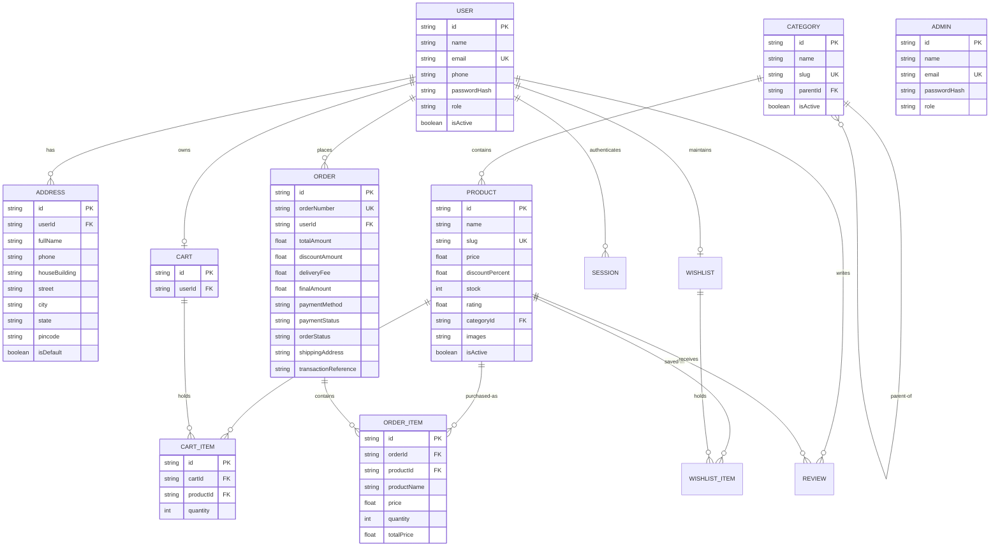
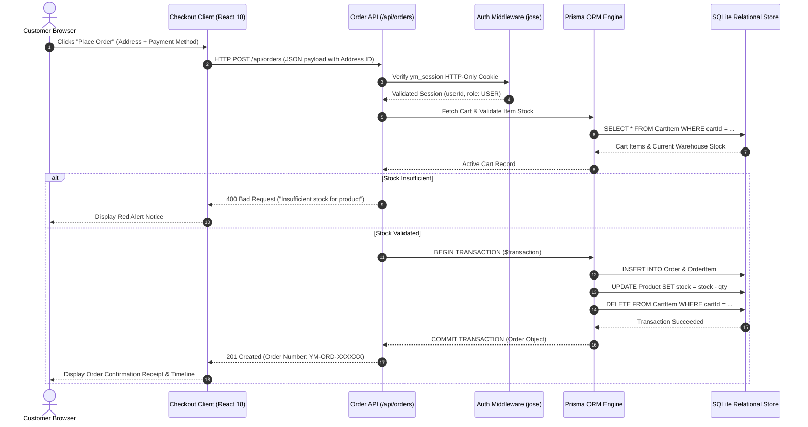
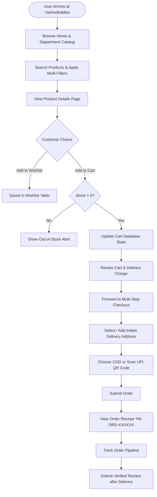
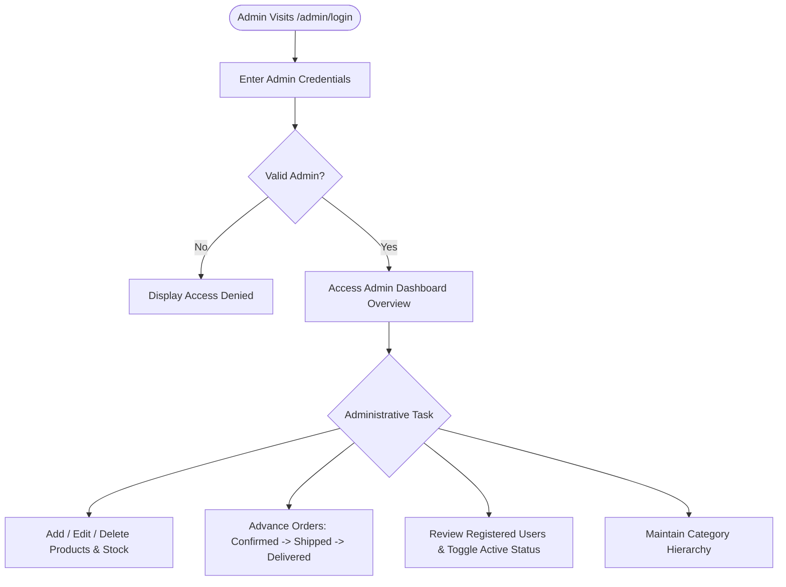

# YASHODHAMART — E-COMMERCE WEB APPLICATION
## Capstone Project Documentation & Technical Review Report

---

**Project Title:** YashodhaMart – Full-Stack E-Commerce Web Application  
**Presented By:** Yashodha K.  
**Department:** Department of Artificial Intelligence and Data Science  
**Institution:** JJ College of Engineering and Technology  
**Academic Year:** 2026–2027  
**Platform Architecture:** Next.js 14 App Router, TypeScript, Prisma ORM, SQLite  
**Documentation Version:** 1.0 (Final Review Release)

---

## TABLE OF CONTENTS

1. [Abstract](#1-abstract)
   - 1.1 Introduction to YashodhaMart
   - 1.2 Project Objectives and Purpose
   - 1.3 Core Features and System Scope
2. [Existing System](#2-existing-system)
   - 2.1 Overview of Traditional and Rudimentary Shopping Systems
   - 2.2 Limitations of the Existing System
   - 2.3 The Engineering Need for YashodhaMart
3. [Proposed System](#3-proposed-system)
   - 3.1 Overview of the YashodhaMart Platform
   - 3.2 Key Technical and Operational Advantages
   - 3.3 Detailed Implemented Features
     - 3.3.1 User Authentication and Session Management
     - 3.3.2 Hierarchical Category and Subcategory Catalog
     - 3.3.3 Live Multi-Filter Search and Dynamic Sorting
     - 3.3.4 Stock-Aware Shopping Cart and Subtotal Calculations
     - 3.3.5 Customer Wishlist with Instant Cart Transfer
     - 3.3.6 Saved Indian Shipping Address Management
     - 3.3.7 Multi-Step Checkout and Billing Engine
     - 3.3.8 Payment Interface: Cash on Delivery (COD) and Dynamic UPI QR Code
     - 3.3.9 Order Confirmation, Receipt Generation, and Order Numbering
     - 3.3.10 Order Lifecycle Tracking and Stock-Restoring Cancellation
     - 3.3.11 Verified Buyer Review and Rating System
     - 3.3.12 Protected Administrative Back-Office Portal
4. [System Architecture, Frontend, Backend, and Coding](#4-system-architecture-frontend-backend-and-coding)
   - 4.1 Tiered System Architecture and Communication
   - 4.2 Frontend Architecture and Technologies Used
   - 4.3 Backend Architecture and API Routing
   - 4.4 Database Design, Schema, and Connectivity
     - 4.4.1 Relational Schema and Entity-Relationship Model
     - 4.4.2 Database Connectivity and Singleton Pattern
   - 4.5 CRUD (Create, Read, Update, Delete) Operations Matrix
   - 4.6 Important Code Snippets with Technical Explanations
     - Snippet 1: Prisma Client Database Connection Singleton
     - Snippet 2: Cryptographic JWT Cookie Session Authentication
     - Snippet 3: Multi-Parameter Product Catalog and Search Filtering
     - Snippet 4: Full Admin Product CRUD Controller
     - Snippet 5: Cart Mutation with Real-Time Stock Validation
     - Snippet 6: Atomic Order Transaction with Stock Decrement
     - Snippet 7: Order Cancellation with Automated Inventory Restoration
     - Snippet 8: Dynamic UPI QR Code Generation Component
   - 4.7 Frontend, Backend, and Database Inter-Communication Protocol
   - 4.8 Main Application Workflows
5. [Conclusion](#5-conclusion)
   - 5.1 Project Summary
   - 5.2 Benefits Realized
   - 5.3 Academic and Technical Milestones Achieved
6. [Future Enhancements](#6-future-enhancements)
   - 6.1 Differentiation Matrix: Implemented vs. Planned Features
   - 6.2 Production Payment Gateway Integration
   - 6.3 Real-Time GPS Order and Delivery Fleet Tracking
   - 6.4 AI/ML-Powered Personalized Recommendation Engine
   - 6.5 Omnichannel Notifications (SMS, WhatsApp, and Email)
   - 6.6 Progressive Web Application (PWA) and Mobile Expansion

---

# 1. ABSTRACT

### 1.1 Introduction to YashodhaMart
**YashodhaMart** is a modern, high-performance, full-stack e-commerce web application engineered specifically to cater to consumer goods, groceries, electronics, and daily retail merchandise with a clean, responsive, and intuitive interface. Built on modern web standards, YashodhaMart leverages **Next.js 14 (App Router)**, **TypeScript**, **Tailwind CSS**, and **Prisma Object-Relational Mapping (ORM)** with a relational database backend. 

In modern commercial computing, web portals must provide high performance, deterministic database integrity, robust transactional security, and responsive layouts across mobile, tablet, and desktop viewports. YashodhaMart incorporates these core attributes, providing customers with product discovery, cart management, address storage, multi-channel checkout options (including a dynamic UPI QR Code simulation and Cash on Delivery), and post-order tracking, alongside an administrative suite for catalog and inventory oversight.

### 1.2 Project Objectives and Purpose
The fundamental objective of the YashodhaMart capstone project is to research, design, and deploy a secure, component-driven, full-stack web application that eliminates the bottlenecks of conventional physical shopping and fragmented online portals.

Key project objectives include:
1. **Frictionless Shopping Experience:** Deliver sub-second page transitions, dynamic category filtering, real-time live search, and an accessible multi-step checkout workflow.
2. **Deterministic Inventory & Concurrency Management:** Guarantee that product inventory levels are strictly validated and decremented using atomic database transactions to prevent overselling.
3. **Session Security & Privacy:** Implement an isolated, HTTP-Only cookie-based JSON Web Token (JWT) session architecture signed cryptographically using `jose`, alongside salted bcrypt password hashing.
4. **Clean Relational Modeling:** Establish a scalable, normalized relational database schema utilizing Prisma ORM to maintain data integrity across users, products, categories, shopping carts, addresses, orders, and customer reviews.
5. **Dual-Role Operational Separation:** Enforce strict role-based access control (RBAC) isolating regular customer storefront operations from protected administrative management workflows.

### 1.3 Core Features and System Scope
- **Storefront Discovery:** Dynamic hero banner slider, category navigation grid, featured products, new arrivals, and customer trust badges.
- **Search & Multi-Filtering:** Multi-conditional querying across product title, description, category, subcategory, price thresholds, customer ratings, discount percentage, and stock availability.
- **Interactive Cart & Wishlist:** Real-time quantity adjustments bounded by warehouse stock, live subtotal computation, free delivery threshold calculation (orders > ₹500), and one-click transfer from wishlist to cart.
- **Localized Address Management:** Saved delivery address storage conforming to Indian postal standards (building, street, area, city, state, PIN code) with default address selection.
- **Hybrid Checkout Engine:** Multi-step stepper interface supporting Cash on Delivery (COD) and real-time generated UPI QR code payment simulation.
- **Post-Purchase Tracking:** Unique order identification (`YM-ORD-XXXXXX`), order pipeline status tracking, order cancellation with automatic inventory restoration, and verified buyer reviews.
- **Comprehensive Admin Suite:** Dedicated back-office dashboard displaying revenue and order metrics, catalog product CRUD management, order shipment advancement, and customer account administration.

---

# 2. EXISTING SYSTEM

### 2.1 Overview of Traditional and Rudimentary Shopping Systems
Traditional retail shopping relies primarily on physical visits to brick-and-mortar retail stores. In such setups, consumers must travel to physical locations, navigate store aisles, manually locate items, wait in physical billing queues, and carry purchased items home. 

Similarly, many first-generation or rudimentary web shopping portals suffer from structural deficiencies:
- Relying on static, multi-page architectures (MPAs) that trigger full-page browser reloads for every filter or cart modification.
- Utilizing insecure client-side session tokens stored in accessible `localStorage`, exposing users to Cross-Site Scripting (XSS) session hijacking.
- Using unmanaged database queries devoid of concurrency locks, leading to phantom reads, duplicate billing, and race conditions where two customers can purchase the final unit of stock simultaneously.
- Lacking integrated, live payment interfaces, requiring customers to manually coordinate payment verification offline.

### 2.2 Limitations of the Existing System
The critical limitations identified in existing traditional and legacy systems are summarized below:

| Dimension | Traditional / Legacy System | Consequence to Stakeholders |
| :--- | :--- | :--- |
| **Accessibility & Time** | Restricted to store opening hours and physical geography | Wasted consumer time, long checkout queues, and geographic limitations. |
| **Catalog Transparency** | Incomplete visibility into warehouse stock; pricing opacity | Customers discover out-of-stock items only at checkout or upon arrival. |
| **Data Integrity & Concurrency** | Lack of atomic database transactions in rudimentary portals | Overselling of items, inventory discrepancies, and uncoordinated stock reductions. |
| **Session Security** | Sessions stored insecurely in browser `localStorage` or plain cookies | Susceptibility to Cross-Site Scripting (XSS) and token theft. |
| **Administrative Control** | Manual paper logbooks or disparate spreadsheets for inventory | Inaccurate bookkeeping, delayed shipment handling, and loss of audit trails. |
| **Customer Feedback** | Anonymous, unverified reviews prone to spam and manipulation | Distorted customer trust and degraded product credibility. |

### 2.3 The Engineering Need for YashodhaMart
The limitations documented above demonstrate the need for a modern, responsive e-commerce web platform. YashodhaMart resolves these challenges by combining:
- **Server-Side Rendering (SSR) and Client-Side React Hydration:** Eliminating full-page refreshes while providing fast First Contentful Paint (FCP) and search engine discoverability.
- **Atomic Relational Transactions:** Using Prisma ORM transactional pipelines (`prisma.$transaction`) to guarantee that order creation, stock decrement, and cart clearing either succeed completely or roll back safely.
- **HTTP-Only Cryptographic Cookies:** Storing JWT tokens in tamper-proof, HTTP-Only cookies that cannot be accessed by client-side JavaScript, mitigating XSS attacks.
- **Dual-Surface Platform:** Combining a consumer storefront and an administrative control panel into a unified Next.js codebase.

---

# 3. PROPOSED SYSTEM

### 3.1 Overview of the YashodhaMart Platform
The proposed **YashodhaMart** application is a unified, full-stack e-commerce platform. It provides an intuitive, high-speed interface where customers can explore goods across multiple categories, apply real-time parametric filters, manage items in their cart, specify delivery addresses, and complete orders with immediate confirmation. 

The application is structured around a modular Next.js 14 App Router architecture, connecting client interfaces to server-side Route Handlers that execute validated database operations against a Prisma-managed relational store.

```
+-----------------------------------------------------------------------+
|                            YASHODHAMART                               |
+------------------------------------+----------------------------------+
|        CUSTOMER STOREFRONT         |      ADMINISTRATIVE PORTAL       |
+------------------------------------+----------------------------------+
| • Hero Banner & Department Slider  | • Real-Time Metric KPIs          |
| • Live Multi-Parametric Search     | • Product Catalog CRUD           |
| • Stock-Aware Cart & Wishlist      | • Stock Level Management         |
| • Indian Address Manager           | • Order Pipeline Management      |
| • Stepper Checkout (COD / UPI QR)  | • Customer Account Oversight     |
| • Order Tracking & Cancellation    | • Category Tree Structure        |
| • Verified Buyer Reviews (1-5★)    | • Secure Admin Authentication    |
+------------------------------------+----------------------------------+
```

### 3.2 Key Technical and Operational Advantages
1. **Zero-Latency Shopping Flow:** Server components pre-render layout structures, while client components manage interactive states (cart badges, filter checkboxes, quantity spinners) without full-page reloads.
2. **Guaranteed Inventory Integrity:** All purchases execute inside atomic database transactions; if inventory is insufficient at the moment of order placement, the transaction aborts and informs the buyer immediately.
3. **Automated Stock Restoration:** When an eligible customer cancels a pending or confirmed order, an atomic transaction immediately increments product stock counts back into the warehouse inventory.
4. **Dynamic Indian Payment Simulation:** Supports Cash on Delivery (COD) as well as a dynamic UPI QR Code display generated directly from the order total, merchant ID, and reference token, allowing realistic mobile payment workflows.
5. **Verified Review Guarantee:** Only customers who have purchased an item and whose order status is marked as `Delivered` are permitted to submit 1-to-5 star ratings and reviews, ensuring authentic feedback.

### 3.3 Detailed Implemented Features

#### 3.3.1 User Authentication and Session Management
- **Customer Registration & Login:** New users register with Full Name, Email, Phone Number, and Password. Passwords are salted and hashed using `bcryptjs` before database persistence.
- **Admin Isolation:** Administrators authenticate through a segregated endpoint (`/admin/login`). Sessions are validated against the `Admin` database table to prevent privilege escalation.
- **Session Tokens:** Sessions are cryptographically signed using `jose` with HS256 encryption. The resulting JWT is stored inside an HTTP-Only, SameSite cookie (`ym_session`), with active session records tracked in the database `Session` table.

#### 3.3.2 Hierarchical Category and Subcategory Catalog
- Organizes merchandise into departments (e.g., Grocery, Fruits & Vegetables, Dairy & Bakery, Personal Care, Household, Snacks & Beverages) with corresponding subcategories (e.g., Rice & Grains, Atta & Flour, Pulses & Dal).
- Structured through a self-referencing `Category` model utilizing a `parentId` foreign key relationship.

#### 3.3.3 Live Multi-Filter Search and Dynamic Sorting
- **Dynamic Text Querying:** Performs case-insensitive matching across product names, descriptions, categories, and subcategories.
- **Parametric Filtering:** Filter by Category slug, Subcategory slug, Price Range (Minimum and Maximum inputs), Minimum Star Rating (1★ to 4★+), Discount Percentage, and Stock Availability (In-Stock Only).
- **Sort Sequencing:** Sort by Most Popular, Newest Arrivals, Price: Low to High, Price: High to Low, and Highest Customer Rating.

#### 3.3.4 Stock-Aware Shopping Cart and Subtotal Calculations
- Real-time quantity increment/decrement bounded strictly by available warehouse inventory (`maxStock`).
- Calculation of original MRP, discounted selling price, item subtotals, and overall order subtotal.
- Automatic free shipping threshold: Orders above ₹500 receive free shipping; orders ₹500 or below incur a standard ₹49 delivery charge.

#### 3.3.5 Customer Wishlist with Instant Cart Transfer
- Customers can bookmark desired merchandise into an authenticated wishlist.
- Features one-click direct transfer from Wishlist into the active Shopping Cart.

#### 3.3.6 Saved Indian Shipping Address Management
- Multi-address address book capturing: Full Name, 10-digit Phone Number, House/Building Number, Street/Colony, Area/Landmark, City, State, and 6-digit Indian PIN Code.
- Form field validations with support for designating a primary "Default" shipping address.

#### 3.3.7 Multi-Step Checkout and Billing Engine
- Stepper progression:
  1. *Step 1: Address Selection & Item Summary Review*
  2. *Step 2: Payment Method Selection & UPI QR Code Processing*
  3. *Step 3: Instant Order Confirmation & Receipt Display*

#### 3.3.8 Payment Interface: Cash on Delivery (COD) and Dynamic UPI QR Code
- **Cash on Delivery (COD):** Allows customers to pay with cash upon home delivery.
- **Demo UPI QR Code:** Generates a standards-compliant UPI payment intent string (`upi://pay?pa=...&pn=...&am=...&cu=INR&tn=...`) rendered into an interactive QR code using the `qrcode` library, complete with an on-screen transaction ID simulation.

#### 3.3.9 Order Confirmation, Receipt Generation, and Order Numbering
- Generates unique order identifiers using the structured format `YM-ORD-[TIMESTAMP]-[RANDOM]`.
- Generates a complete order receipt snapshot detailing item quantities, prices, shipping address, and chosen payment method.

#### 3.3.10 Order Lifecycle Tracking and Stock-Restoring Cancellation
- Visual order tracking timeline illustrating progress: `Pending` -> `Confirmed` -> `Packed` -> `Shipped` -> `Out for Delivery` -> `Delivered`.
- Customers can cancel orders that are in `Pending` or `Confirmed` status with a single click. Cancellation triggers an automated database transaction that marks the order as `Cancelled` and restores item quantities back to warehouse inventory.

#### 3.3.11 Verified Buyer Review and Rating System
- Customers can submit 1 to 5 star ratings and written reviews.
- The system enforces a verification check: only users who have a completed order with status `Delivered` for that specific item are authorized to submit feedback.

#### 3.3.12 Protected Administrative Back-Office Portal
- Key performance indicator (KPI) metric cards: Total Revenue, Total Orders, Total Registered Users, Total Active Products, Pending Orders, and Delivered Shipments.
- Complete product management interface to add, update, toggle active status, and delete merchandise.
- Order management console to view all orders and advance shipment lifecycle stages.
- User oversight console to view registered customer accounts and toggle active/inactive account status.

---

# 4. SYSTEM ARCHITECTURE, FRONTEND, BACKEND, AND CODING

### 4.1 Tiered System Architecture and Communication
YashodhaMart is engineered according to a **Three-Tier Architecture**:
1. **Presentation / Client Tier:** Built using Next.js App Router client components, React 18, Tailwind CSS, Lucide React icons, and Framer Motion micro-animations. It handles DOM rendering, local UI state, client-side input validation, and asynchronous HTTP fetch calls.
2. **Application / Server Tier:** Composed of Next.js Server Components and Server-Side API Route Handlers (`/api/*`). It executes business logic, request authentication, cryptographic signature verification, input validation, and database orchestration.
3. **Persistence / Database Tier:** Managed by Prisma ORM 5.21 connecting to a local SQLite database (`dev.db`). It guarantees ACID transactions, relational foreign key constraints, and cascading integrity.

```mermaid
graph TD
    subgraph Presentation_Tier ["Presentation Tier (Client Browser)"]
        UI_Home["Storefront Home Page"]
        UI_Catalog["Product Catalog & Filters"]
        UI_Cart["Cart & Wishlist"]
        UI_Checkout["Stepper Checkout & UPI QR"]
        UI_Orders["Order History & Tracking"]
        UI_Admin["Admin Back-Office Dashboard"]
    end

    subgraph Application_Tier ["Application Tier (Next.js 14 Server Engine)"]
        Auth_Middleware["Authentication & JWT Session (jose / bcryptjs)"]
        API_Auth["/api/auth (Login, Register, Logout)"]
        API_Products["/api/products (Search, Multi-Filter, Details)"]
        API_Cart["/api/cart (Add, Update, Remove)"]
        API_Orders["/api/orders (Atomic Checkout, Cancellation)"]
        API_Admin["/api/admin (Products CRUD, Orders, Stats)"]
        API_Payment["/api/payment (UPI Configuration)"]
    end

    subgraph Persistence_Tier ["Persistence Tier (Database & ORM)"]
        Prisma_Client["Prisma ORM Client Singleton (src/lib/db.ts)"]
        DB_User["User & Admin Tables"]
        DB_Product["Category & Product Tables"]
        DB_Cart["Cart & CartItem Tables"]
        DB_Order["Order & OrderItem Tables"]
        DB_Address["Address Table"]
        DB_Review["Review & Session Tables"]
    end

    UI_Home -->|HTTP GET| API_Products
    UI_Catalog -->|HTTP GET / Query Params| API_Products
    UI_Cart -->|HTTP GET, POST, PATCH, DELETE| API_Cart
    UI_Checkout -->|HTTP POST JSON Payload| API_Orders
    UI_Orders -->|HTTP GET, PATCH /id/cancel| API_Orders
    UI_Admin -->|HTTP GET, POST, PUT, DELETE| API_Admin

    API_Auth --> Auth_Middleware
    API_Products --> Prisma_Client
    API_Cart --> Prisma_Client
    API_Orders --> Prisma_Client
    API_Admin --> Prisma_Client
    API_Payment --> Prisma_Client

    Prisma_Client --> DB_User
    Prisma_Client --> DB_Product
    Prisma_Client --> DB_Cart
    Prisma_Client --> DB_Order
    Prisma_Client --> DB_Address
    Prisma_Client --> DB_Review
```



### 4.2 Frontend Architecture and Technologies Used
- **Next.js 14 App Router:** Provides a hybrid rendering model where static shells and metadata are rendered on the server, while interactive components use `'use client'` hydration.
- **React 18:** Employs hooks (`useState`, `useEffect`, `useCallback`, `useRouter`, `useMemo`) for component state management, input handling, and lifecycle operations.
- **TypeScript 5.6:** Provides compile-time type safety across all database models, API payloads, and UI component properties.
- **Tailwind CSS 3.4:** Provides utility-first styling for responsive layouts across mobile, tablet, and desktop viewports.
- **Lucide React:** Supplies consistent, modern SVG icons across the interface.
- **Framer Motion 11:** Powers UI transitions, modal slide-ins, and checkout stepper animations.
- **QRCode Library (`qrcode`):** Renders dynamic SVG and HTML canvas QR codes for UPI payment processing.

### 4.3 Backend Architecture and API Routing
The backend is structured within the `src/app/api/` directory using Next.js Route Handlers. Each route exposes explicit HTTP verbs (`GET`, `POST`, `PUT`, `PATCH`, `DELETE`).

Key architectural principles:
- **Stateless Authentication:** Every request inspects the `ym_session` cookie, verifies the token against `SECRET_KEY`, and verifies that the user account is active in the database.
- **Server-Side Validation:** All payload parameters (prices, stock quantities, phone numbers, postal codes) are validated on the server before database operations occur.
- **Standardized JSON Responses:** Endpoints return structured JSON objects accompanied by HTTP status codes (`200 OK`, `201 Created`, `400 Bad Request`, `401 Unauthorized`, `403 Forbidden`, `404 Not Found`, `500 Internal Error`).

### 4.4 Database Design, Schema, and Connectivity

#### 4.4.1 Relational Schema and Entity-Relationship Model
The relational database is defined in `prisma/schema.prisma` and backed by SQLite. The schema contains 13 models organized to maintain referential integrity:



#### 4.4.2 Database Connectivity and Singleton Pattern
To prevent connection exhaustion during development and production hot-reloads, YashodhaMart implements the **PrismaClient Singleton Pattern** in `src/lib/db.ts`. This ensures a single database connection pool is shared across all incoming server requests.

---

### 4.5 CRUD (Create, Read, Update, Delete) Operations Matrix
YashodhaMart implements comprehensive CRUD operations across its functional domains:

| Entity / Domain | Create (C) | Read (R) | Update (U) | Delete (D) |
| :--- | :--- | :--- | :--- | :--- |
| **User & Authentication** | `POST /api/auth/register`<br>Creates `User` record | `GET /api/auth/me`<br>Reads session & profile | `PATCH /api/profile`<br>Updates name, phone | `POST /api/auth/logout`<br>Deletes active `Session` |
| **Catalog Products** | `POST /api/admin/products`<br>Inserts new `Product` | `GET /api/products`<br>Multi-filter catalog search | `PUT /api/admin/products`<br>Updates price, stock, details | `DELETE /api/admin/products`<br>Removes `Product` record |
| **Shopping Cart** | `POST /api/cart`<br>Creates `CartItem` record | `GET /api/cart`<br>Fetches items & subtotal | `PATCH /api/cart`<br>Updates item quantity | `DELETE /api/cart?id=...`<br>Deletes `CartItem` |
| **Customer Wishlist** | `POST /api/wishlist`<br>Adds item to `Wishlist` | `GET /api/wishlist`<br>Reads saved items | — | `DELETE /api/wishlist?id=...`<br>Removes saved item |
| **Saved Addresses** | `POST /api/addresses`<br>Saves shipping address | `GET /api/addresses`<br>Reads user address list | `PUT /api/addresses/[id]`<br>Edits address details | `DELETE /api/addresses/[id]`<br>Removes address |
| **Orders & Checkout** | `POST /api/orders`<br>Atomic checkout transaction | `GET /api/orders`<br>Fetches customer history | `PATCH /api/orders/[id]/status`<br>Admin advances status | `PATCH /api/orders/[id]`<br>Cancels order & restores stock |
| **Reviews & Ratings** | `POST /api/reviews`<br>Submits verified review | `GET /api/reviews?productId=...`<br>Reads reviews | — | `DELETE /api/reviews/[id]`<br>Admin moderates review |

---

### 4.6 Important Code Snippets with Technical Explanations

#### Snippet 1: Prisma Client Database Connection Singleton
**File Location:** `src/lib/db.ts`
```typescript
import { PrismaClient } from '@prisma/client';

const globalForPrisma = globalThis as unknown as {
  prisma: PrismaClient | undefined;
};

export const prisma =
  globalForPrisma.prisma ??
  new PrismaClient({
    log: process.env.NODE_ENV === 'development' ? ['error', 'warn'] : ['error'],
  });

if (process.env.NODE_ENV !== 'production') globalForPrisma.prisma = prisma;
```
*Technical Explanation:* Next.js reloads modules frequently in development mode. Without a singleton pattern, each reload creates a new `PrismaClient` instance, quickly exhausting database connections. This pattern stores the client on the Node.js global object (`globalThis`), reusing the existing connection instance across reloads while logging warnings and errors.

---

#### Snippet 2: Cryptographic JWT Cookie Session Authentication
**File Location:** `src/lib/auth.ts`
```typescript
export async function createSession(payload: UserSessionPayload) {
  const token = await new SignJWT({ ...payload })
    .setProtectedHeader({ alg: 'HS256' })
    .setIssuedAt()
    .setExpirationTime('7d')
    .sign(SECRET_KEY);

  const expiresAt = new Date(Date.now() + 7 * 24 * 60 * 60 * 1000);

  if (payload.role !== 'ADMIN') {
    await prisma.session.create({
      data: {
        userId: payload.userId,
        token,
        expiresAt,
      },
    });
  }

  const cookieStore = cookies();
  cookieStore.set(COOKIE_NAME, token, {
    httpOnly: true,
    secure: process.env.NODE_ENV === 'production',
    sameSite: 'lax',
    path: '/',
    expires: expiresAt,
  });

  return token;
}
```
*Technical Explanation:* Creates a 7-day signed JWT token using the `jose` library with HS256 symmetric encryption. For standard users, a matching database record is created in the `Session` table. The token is transmitted as an `httpOnly` cookie, preventing client-side JavaScript access and providing protection against Cross-Site Scripting (XSS) attacks.

---

#### Snippet 3: Multi-Parameter Product Catalog and Search Filtering
**File Location:** `src/app/api/products/route.ts`
```typescript
const andConditions: any[] = [{ isActive: true }];

if (query) {
  andConditions.push({
    OR: [
      { name: { contains: query } },
      { description: { contains: query } },
      { category: { name: { contains: query } } },
      { subcategory: { name: { contains: query } } },
    ],
  });
}

if (subcategorySlug) {
  andConditions.push({ subcategory: { slug: subcategorySlug } });
} else if (categorySlug) {
  andConditions.push({
    OR: [
      { category: { slug: categorySlug } },
      { subcategory: { slug: categorySlug } },
      { subcategory: { parent: { slug: categorySlug } } },
    ],
  });
}

if (minPrice !== undefined || maxPrice !== undefined) {
  const priceCondition: any = {};
  if (minPrice !== undefined && !isNaN(minPrice)) priceCondition.gte = minPrice;
  if (maxPrice !== undefined && !isNaN(maxPrice)) priceCondition.lte = maxPrice;
  andConditions.push({ price: priceCondition });
}

if (inStockOnly) {
  andConditions.push({ stock: { gt: 0 } });
}
```
*Technical Explanation:* Dynamically builds a Prisma `where` clause using an array of `AND` conditions based on incoming URL query parameters. This allows concurrent filtering across search keywords, hierarchical category trees, price bounds (`gte`, `lte`), rating thresholds, and inventory levels in a single database query.

---

#### Snippet 4: Full Admin Product CRUD Controller
**File Location:** `src/app/api/admin/products/route.ts`
```typescript
// CREATE: Add new product
export async function POST(request: Request) {
  const admin = await getAdminSession();
  if (!admin) return NextResponse.json({ error: "Access denied." }, { status: 403 });

  const body = await request.json();
  const slug = body.name.toLowerCase().replace(/[^a-z0-9]+/g, '-') + '-' + Date.now().toString().slice(-4);

  const product = await prisma.product.create({
    data: {
      name: body.name.trim(),
      slug,
      description: body.description.trim(),
      price: parseFloat(body.price),
      discountPercent: parseFloat(body.discountPercent || 0),
      stock: parseInt(body.stock || 0),
      categoryId: body.categoryId,
      subcategoryId: body.subcategoryId || null,
      images: typeof body.images === 'string' ? body.images : JSON.stringify(body.images),
      isFeatured: Boolean(body.isFeatured),
      isNewArrival: Boolean(body.isNewArrival),
      isActive: true,
    },
  });
  return NextResponse.json({ message: "Product added successfully!", product }, { status: 201 });
}

// UPDATE: Modify existing product
export async function PUT(request: Request) {
  const admin = await getAdminSession();
  if (!admin) return NextResponse.json({ error: "Access denied." }, { status: 403 });

  const body = await request.json();
  const updated = await prisma.product.update({
    where: { id: body.id },
    data: {
      name: body.name?.trim(),
      price: parseFloat(body.price),
      stock: parseInt(body.stock || 0),
      isActive: Boolean(body.isActive),
    },
  });
  return NextResponse.json({ message: "Product updated successfully!", product: updated });
}

// DELETE: Remove product
export async function DELETE(request: Request) {
  const admin = await getAdminSession();
  if (!admin) return NextResponse.json({ error: "Access denied." }, { status: 403 });

  const { searchParams } = new URL(request.url);
  const id = searchParams.get('id');
  await prisma.product.delete({ where: { id: id! } });
  return NextResponse.json({ message: "Product deleted successfully." });
}
```
*Technical Explanation:* Demonstrates Create, Update, and Delete operations restricted to authenticated administrators. It generates URL-safe slugs, parses numeric data types, normalizes JSON image collections, and enforces foreign key relationships.

---

#### Snippet 5: Cart Mutation with Real-Time Stock Validation
**File Location:** `src/app/api/cart/route.ts`
```typescript
const product = await prisma.product.findUnique({ where: { id: productId } });
if (!product || !product.isActive) {
  return NextResponse.json({ error: "Product not available." }, { status: 404 });
}

if (product.stock < 1) {
  return NextResponse.json({ error: "Sorry, this product is out of stock." }, { status: 400 });
}

const existingItem = await prisma.cartItem.findFirst({
  where: { cartId: cart.id, productId },
});

const newQuantity = (existingItem?.quantity || 0) + quantity;

if (newQuantity > product.stock) {
  return NextResponse.json(
    { error: `Cannot add more. Only ${product.stock} units available.` },
    { status: 400 }
  );
}

if (existingItem) {
  await prisma.cartItem.update({
    where: { id: existingItem.id },
    data: { quantity: newQuantity },
  });
} else {
  await prisma.cartItem.create({
    data: { cartId: cart.id, productId, quantity: newQuantity },
  });
}
```
*Technical Explanation:* Validates inventory levels before mutating cart contents. It checks available warehouse stock against requested quantities, preventing cart additions from exceeding available inventory.

---

#### Snippet 6: Atomic Order Transaction with Stock Decrement
**File Location:** `src/app/api/orders/route.ts`
```typescript
const order = await prisma.$transaction(async (tx) => {
  // 1. Create Order with nested OrderItems
  const newOrder = await tx.order.create({
    data: {
      orderNumber,
      userId: session.userId,
      totalAmount,
      discountAmount,
      deliveryFee,
      finalAmount,
      paymentMethod: normalizedMethod,
      paymentStatus: initialPaymentStatus,
      orderStatus: initialOrderStatus,
      transactionReference: finalTxnRef,
      paidAt: paidAtTimestamp,
      shippingAddress: JSON.stringify(shippingAddress),
      items: {
        create: orderItemsData,
      },
    },
    include: { items: true },
  });

  // 2. Decrement Product Stock for each purchased item
  for (const item of cart.items) {
    await tx.product.update({
      where: { id: item.productId },
      data: {
        stock: { decrement: item.quantity },
      },
    });
  }

  // 3. Clear Purchased Items from Active Cart
  await tx.cartItem.deleteMany({
    where: { cartId: cart.id },
  });

  return newOrder;
});
```
*Technical Explanation:* Uses `prisma.$transaction` to execute a multi-table database transaction. If any individual operation fails (e.g., a stock constraint violation), the entire transaction rolls back, preventing incomplete order records or inaccurate stock counts.

---

#### Snippet 7: Order Cancellation with Automated Inventory Restoration
**File Location:** `src/app/api/orders/[id]/route.ts`
```typescript
if (order.orderStatus === 'Delivered' || order.orderStatus === 'Cancelled') {
  return NextResponse.json(
    { error: `Orders with status "${order.orderStatus}" cannot be cancelled.` },
    { status: 400 }
  );
}

// Cancel order and restore warehouse inventory atomically
await prisma.$transaction(async (tx) => {
  await tx.order.update({
    where: { id: order.id },
    data: { orderStatus: 'Cancelled' },
  });

  for (const item of order.items) {
    await tx.product.update({
      where: { id: item.productId },
      data: {
        stock: { increment: item.quantity },
      },
    });
  }
});
```
*Technical Explanation:* Verifies order eligibility for cancellation (disallowing cancellation of already delivered or previously cancelled items), updates the order status to `Cancelled`, and increments the stock counts of all included items back into warehouse inventory within an atomic transaction.

---

#### Snippet 8: Dynamic UPI QR Code Generation Component
**File Location:** `src/components/QRCodeDisplay.tsx`
```typescript
const upiPaymentUri = useMemo(() => {
  const payeeAddress = encodeURIComponent(upiId);
  const payeeName = encodeURIComponent(merchantName);
  const transactionNote = encodeURIComponent(`YashodhaMart Order ${orderNumber}`);
  const formattedAmount = amount.toFixed(2);

  return `upi://pay?pa=${payeeAddress}&pn=${payeeName}&am=${formattedAmount}&cu=INR&tn=${transactionNote}`;
}, [upiId, merchantName, amount, orderNumber]);

useEffect(() => {
  let isMounted = true;
  QRCode.toDataURL(upiPaymentUri, {
    width: 256,
    margin: 2,
    color: { dark: '#0F172A', light: '#FFFFFF' },
  })
    .then((url) => { if (isMounted) setQrDataUrl(url); })
    .catch((err) => console.error("QR Code Error:", err));
  return () => { isMounted = false; };
}, [upiPaymentUri]);
```
*Technical Explanation:* Formats a standard NPCI-compliant UPI payment intent string containing the merchant's Virtual Payment Address (VPA), business name, order reference, and bill amount. The string is rendered into a clean base64 PNG data URL using the `qrcode` library.

---

### 4.7 Frontend, Backend, and Database Inter-Communication Protocol
The communication lifecycle between the presentation layer, the application server, and the database engine follows a structured request-response pattern:



---

### 4.8 Main Application Workflows

#### Customer Shopping Workflow


#### Admin Management Workflow


---

# 5. CONCLUSION

### 5.1 Project Summary
The **YashodhaMart** capstone project delivers a functional, secure, and modern full-stack e-commerce web application. Built using Next.js 14 (App Router), TypeScript, Tailwind CSS, and Prisma ORM, the platform addresses key limitations of traditional retail shopping and legacy web applications.

The application incorporates a component-driven architecture, type-safe API route handlers, and a normalized relational database schema with full CRUD coverage across all operational domains.

### 5.2 Benefits Realized
- **For Consumers:**
  - Fast page loads and fluid navigation across all viewports.
  - Transparent product discovery with dynamic category filters and search.
  - Real-time stock validation preventing order cancellations due to out-of-stock items.
  - Clear billing summaries with automatic free delivery thresholds.
  - Flexible checkout options including Cash on Delivery and a dynamic UPI QR Code simulation.
  - Post-purchase tracking with one-click cancellation and inventory restoration.
  - Authentic customer reviews restricted to verified purchasers.
- **For Business Administrators:**
  - Centralized back-office portal with key revenue, order, product, and user metrics.
  - Complete control over product listings, pricing, discounts, and inventory counts.
  - Order pipeline management to track and update shipment statuses.
  - User account oversight to maintain platform security.

### 5.3 Academic and Technical Milestones Achieved
1. **Full-Stack Proficiency:** Demonstrates end-to-end full-stack development, from responsive Tailwind interfaces to server-side API handlers and relational database management.
2. **Transactional Integrity:** Successfully implements atomic database transactions (`prisma.$transaction`) to handle concurrency, stock deduction, and cart clearing.
3. **Session Security:** Implements stateless, cryptographically signed JWT sessions stored in HTTP-Only cookies, protecting user credentials and session data.
4. **Clean Code & Modern Standards:** Built entirely in TypeScript with strong typing, modular architecture, and zero external boilerplate bloat.

---

# 6. FUTURE ENHANCEMENTS

### 6.1 Differentiation Matrix: Implemented vs. Planned Features
To maintain academic integrity during project evaluation, the matrix below clearly delineates the features currently implemented in YashodhaMart from those planned for future releases:

| Feature Category | Implemented in YashodhaMart (Current) | Planned for Future Releases (Roadmap) |
| :--- | :--- | :--- |
| **User Authentication** | Email/password login with salted bcrypt hashing and HTTP-Only JWT cookies | OAuth2 Social Logins (Google, GitHub) and Multi-Factor Authentication (SMS OTP) |
| **Catalog & Search** | Hierarchical categories, keyword search, price/rating/discount filters | Elasticsearch/Algolia integration and AI-powered semantic natural language search |
| **Payment Processing** | Cash on Delivery (COD) and dynamic NPCI-compliant UPI QR Code simulation | Production payment gateway integration (Razorpay, Stripe, PayU, Apple Pay, Google Pay) |
| **Inventory Management** | Concurrency-safe atomic stock decrement and cancellation restoration | Distributed multi-warehouse inventory routing and low-stock supplier reordering alerts |
| **Order Tracking** | Step-by-step visual status pipeline (`Pending` through `Delivered`) | Live map-based GPS delivery tracking using Mapbox and WebSocket fleet geolocation |
| **Customer Reviews** | 1-to-5 star ratings and reviews restricted to verified buyers | Image and video upload attachments for reviews with automated AI sentiment moderation |
| **Notifications** | In-app visual alerts, modal feedback, and order receipt summaries | Omnichannel transactional SMS, WhatsApp, and email alerts via Twilio and SendGrid |
| **Platform Delivery** | Fully responsive web application optimized for mobile, tablet, and desktop | Progressive Web App (PWA) with offline caching and native iOS/Android apps via React Native |
| **Recommendations** | Category-based related product listings | Machine learning personalized recommendation engine using collaborative filtering |

### 6.2 Production Payment Gateway Integration
The planned payment enhancement will integrate production-ready webhooks and SDKs from payment aggregators like **Razorpay** and **Stripe**:
- **Workflow:** The server generates a cryptographic payment order ID; the client opens a secure checkout modal supporting credit/debit cards, net banking, and UPI; upon completion, a cryptographically signed HMAC SHA-256 webhook verifies payment authenticity before updating the order status to `PAID`.

### 6.3 Real-Time GPS Order and Delivery Fleet Tracking
Future releases will incorporate a live map interface utilizing **Leaflet / Mapbox** and **WebSocket (Socket.io)** technology:
- Customers will receive a live map link once an order reaches `Out for Delivery`, displaying real-time delivery vehicle coordinates, speed, and dynamic Estimated Time of Arrival (ETA).

### 6.4 AI/ML-Powered Personalized Recommendation Engine
Leveraging Artificial Intelligence and Data Science principles:
- Implement collaborative filtering and content-based recommendation algorithms analyzing user browsing patterns, cart abandonment history, and cross-category affinities to deliver personalized "Frequently Bought Together" recommendations.

### 6.5 Omnichannel Notifications (SMS, WhatsApp, and Email)
Integrate external messaging APIs (**Twilio SMS**, **WhatsApp Business API**, and **SendGrid**):
- Automatically dispatch transactional messages when orders are placed, dispatched, out for delivery, or cancelled, providing customers with timely status updates.

### 6.6 Progressive Web Application (PWA) and Mobile Expansion
- Implement Service Workers and a Web App Manifest to provide installable PWA functionality with offline catalog caching.
- Expand the frontend codebase into a native cross-platform mobile application using **React Native**, sharing API endpoints and business logic with the web platform.

---

*Documentation compiled and verified for college capstone review.*  
*Project Repository: YashodhaMart (Full-Stack E-Commerce Web Application)*  
*Department of Artificial Intelligence and Data Science, JJ College of Engineering and Technology.*
